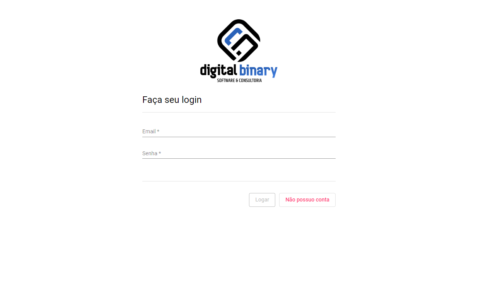
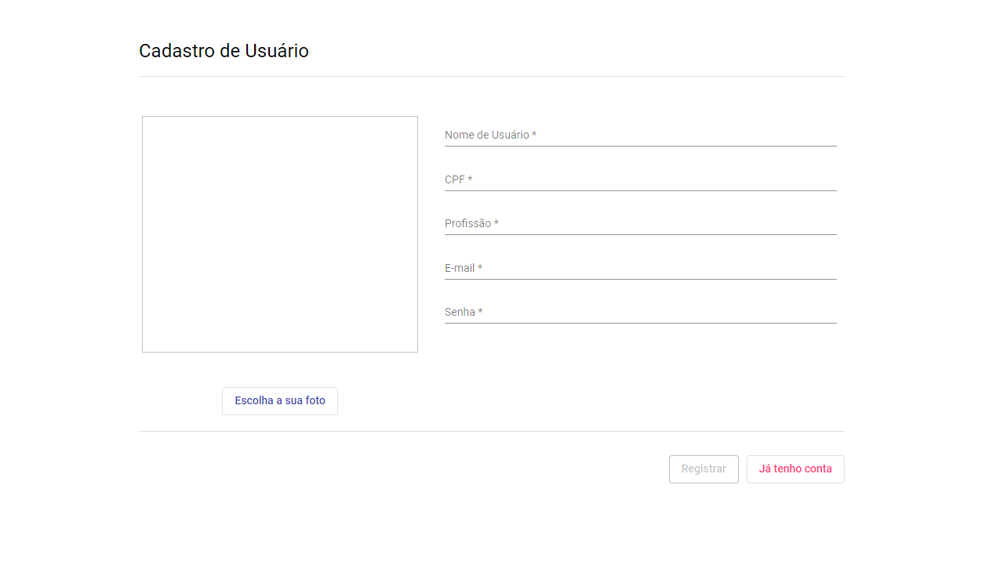
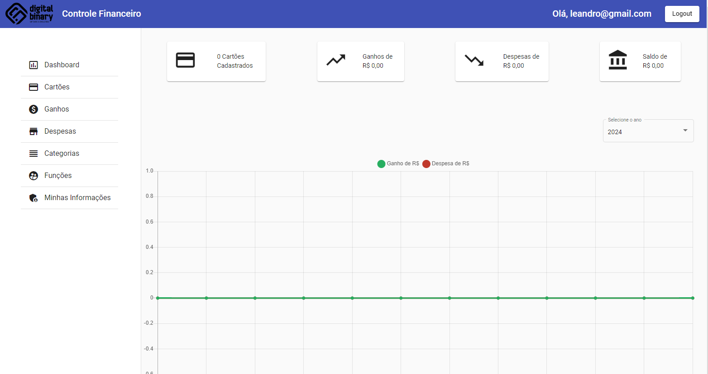
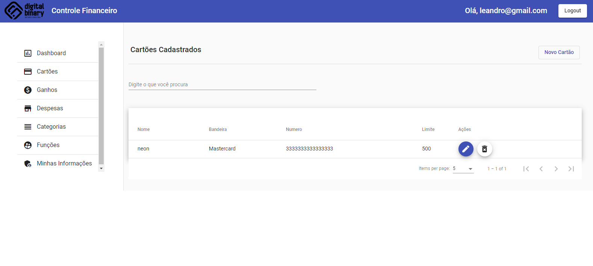
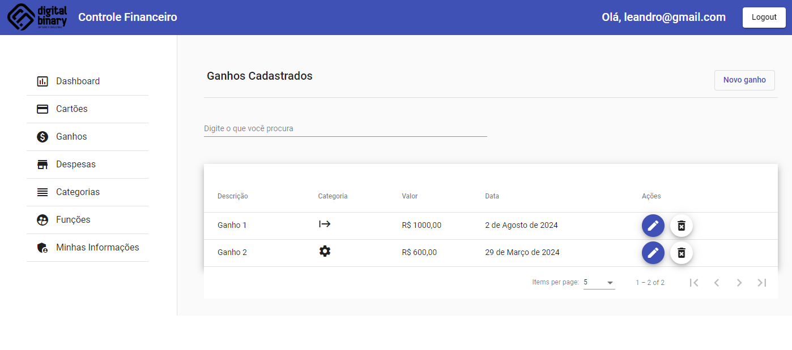
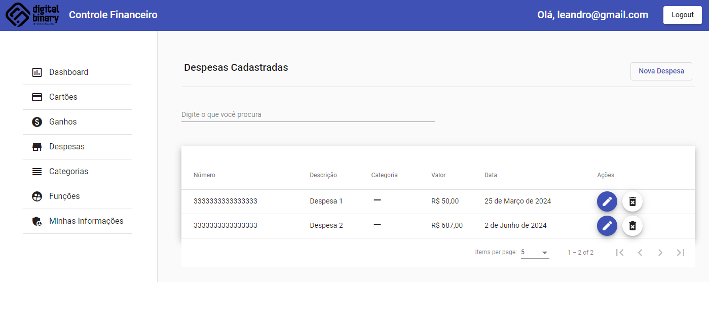
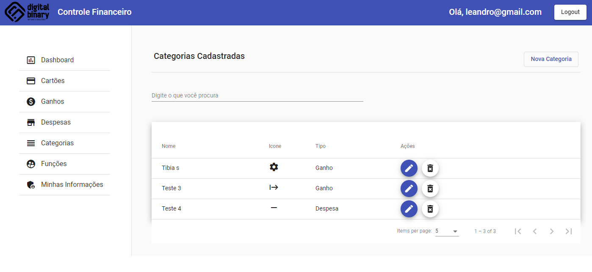
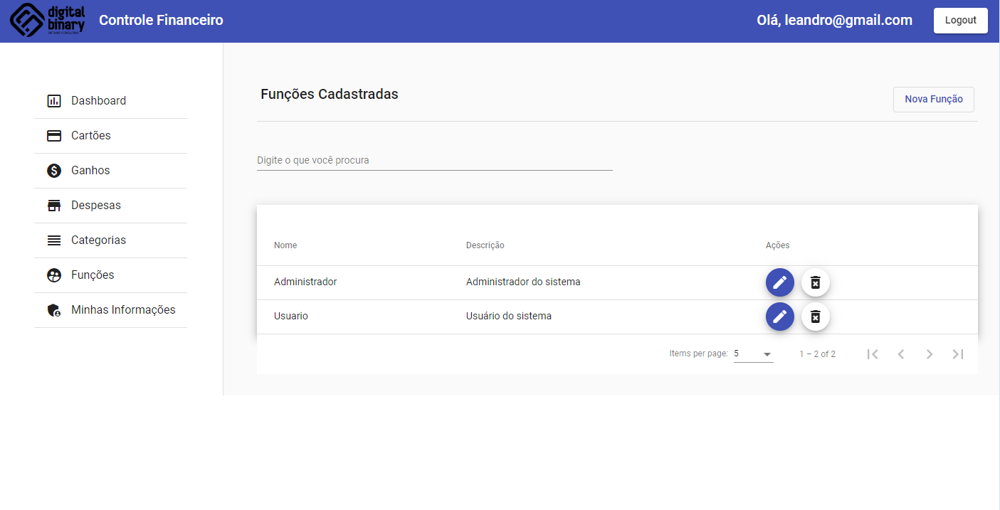
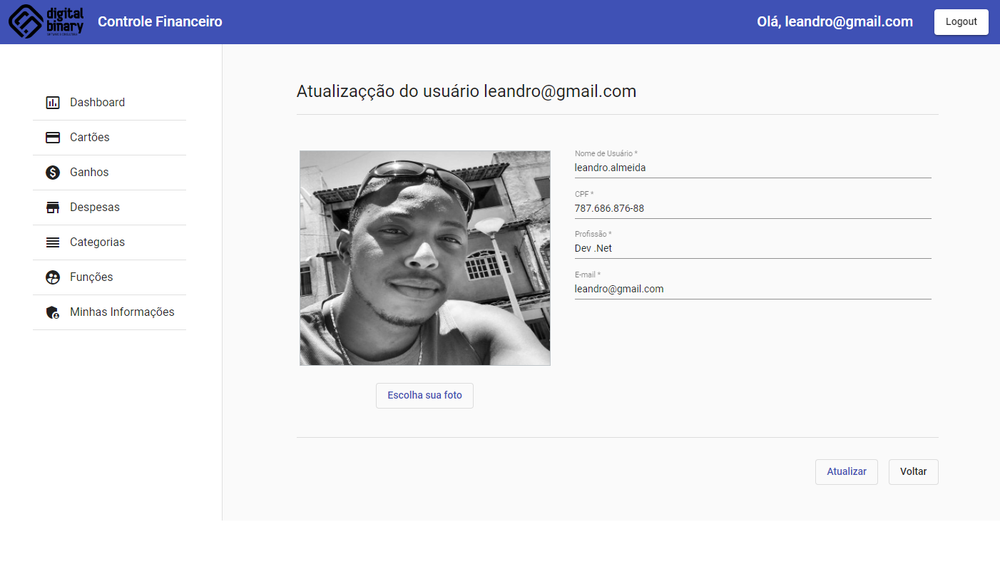

# Sistema de Controle Financeiro

Projeto web para controle financeiro feito com Angular e .Net 6

Bem-vindo ao repositório do Sistema de Controle Financeiro! Este sistema foi desenvolvido para ajudar a gerenciar suas finanças pessoais ou empresariais de maneira eficiente. Ele foi construído utilizando Angular no front-end e .NET no back-end.

# Visão Geral

O Sistema de Controle Financeiro permite que os usuários:

* Adicionem, editem e excluam despesas e receitas.
* Visualizem relatórios financeiros.
* Usem máscaras de entrada para valores monetários.
* Ordenem e filtrem dados financeiros.
* Utilizem uma interface amigável e responsiva.

# Funcionalidades

Front-end (Angular)
* Componentes de Material Design: Usamos mat-form-field, mat-select, mat-option e outros componentes do Angular Material para uma interface moderna e responsiva.
* Máscara de Entrada: Utilizamos NgxMaskModule para máscaras de entrada, facilitando a entrada de valores monetários.
* Pipes Personalizados: Implementamos pipes para formatação de valores monetários.

Back-end (.NET)
* API RESTful: Criamos uma API RESTful utilizando .NET 6 para gerenciar as operações de CRUD (Create, Read, Update, Delete) de receitas e despesas.
* Validações: Integramos FluentValidation para validar dados de entrada.
* Repositórios: Usamos o padrão de repositório para organizar a lógica de acesso a dados.

## Pré-requisitos

✔ - .NET 6 SDK

✔ - Node.js e npm

✔ - Angular CLI

## Passos para instalação

1. Clone o repositório:
```
- git clone https://github.com/seu-usuario/sistema-controle-financeiro.git
```

2. Instale as dependências do front-end:
```
- cd frontend
- npm install
```

3. Gerar as migrations do banco de dados no backend e rodar o projeto:
```
- update-database
```

4. Executando o front-end:
```
- ng serve
```

# Prints do Projeto

- Login


##

- Registro


##

- Dashboard


##

- Cartões


##

- Ganhos


##

- Despesas


##

- Categorias


##

- Funções de Usuário


##

- Infos de Usuário

